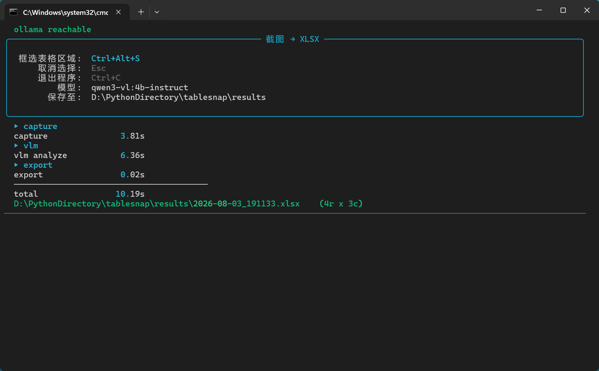

# tablesnap

[English](README.md) | [简体中文](README_zh.md)

## 预览



tablesnap 实际运行效果：截屏 → 表格识别 → XLSX 导出，全程命令行完成。

截图 → VLM 视觉语言模型直接识别 → 导出 XLSX。

## 快速开始

双击 `Launch Tablesnap Tool.cmd`，或：

```bash
cd path\to\tablesnap
uv run python main.py
```

启动后按 ``Ctrl+Alt+S`` 截图（拖拽选择区域），XLSX 自动保存到项目内 ``results/`` 目录。截图保存在 ``results/captures/``，与 XLSX 共用同一时间戳。

> 提示：按下 ``Esc`` 可取消本次截图。

## 批处理模式

无需截图界面，直接转换已有图片文件为 XLSX：

```bash
uv run python main.py file a.png b.jpg
```

逐张识别并导出到 ``results/``，结束后汇总成功/失败数量。支持的扩展名：PNG、JPG、JPEG、BMP、TIFF、WEBP。

## 配置

所有可调参数集中在 ``core/config.py``。不改代码即可覆盖：

1. **复制模板再改**：把项目根目录的 ``config.example.json``（已提交到 git）复制成 ``config.json``，改里面任何键即可。例如换模型和快捷键，在 ``config.json`` 里写：

   ```json
   { "VLM_MODEL": "qwen3-vl:2b-instruct", "HOTKEY": "ctrl+alt+x" }
   ```

2. **环境变量**：``TABLESNAP_<常量名>``（如 ``TABLESNAP_VLM_MODEL``），优先级高于 ``config.json``。

优先级：环境变量 > ``config.json`` > 文件默认值。

随时查看当前生效的配置：

```bash
uv run python main.py --print-config
```

会打印每个可覆盖键的当前值和来源（``default`` / ``config.json`` / ``env:TABLESNAP_*``）。``config.json`` 已被 git 忽略——你的本地设置不会被提交。完整键列表见 ``docs/ARCHITECTURE.md``。

## 前置要求

- Python 3.10+
- [Ollama](https://ollama.com/) 已安装并运行
- VLM 模型已加载：`ollama pull qwen3-vl:4b-instruct`

## 使用方式

1. 打开需要截图的画面（如股票行情列表）
2. 按 ``Ctrl+Alt+S``
3. 屏幕变暗 → 鼠标拖拽框选要识别的区域（框内显示原图）→ 松开自动识别
4. XLSX 自动出现在 ``results/`` 目录，截图保存在 ``results/captures/``

## 安装

```bash
uv sync
```

## 技术栈

- 选区：tkinter 全屏叠加层（拖拽选择）
- 截图：mss
- 识别：Qwen3-VL 视觉语言模型（本地 Ollama）
- 导出：openpyxl
- 快捷键：keyboard

## 如何测试

```bash
# 全部单测（无需 Ollama）
uv run python -m pytest -v

# 端到端测试（需要 Ollama + 模型已加载）
uv run python tests/test_end_to_end.py
```

测试输出位于 `tests/test_output/`，每次运行前自动清理旧 `.xlsx` 和 `.json` 文件。

### 调试工具

调试时可随时用 `read_xlsx.py` 读取任意 XLSX 文件：

```bash
uv run python tests/read_xlsx.py path/to/file.xlsx
```

## 了解更多

- `docs/ARCHITECTURE.md` — 工作流、模块关系、数据流向、错误处理策略
- `docs/PHILOSOPHY.md` — 设计哲学：为什么选择 VLM 直出而非 OCR 流水线
- `docs/DEPLOYMENT.md` — Ollama 部署、模型管理、配置路径参考（面向 AI Agent）
- `core/config.py` — 所有可调参数的统一配置入口
